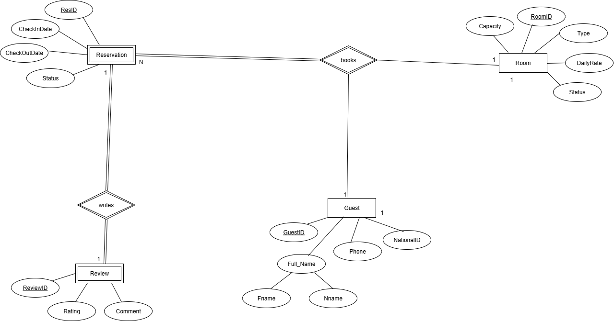

# HotelRoom_Architecture_DataAnnotation_FluentAPI

## Overview
Console-based hotel room management using layered architecture and database connect with data annotaion and Fluent API.
Implements: Add/View Rooms, Reserve, View Reservations, Search by Guest, Highest-Paying Guest, Cancel, Exit.

## Project Development Process
### 1. ER Digram 


### 2. Setup And Configuration 
This step includes install database packages, such as: 
  1. Microsoft.EntityFrameworkCore
  2. Microsoft.EntityFrameworkCore.tools
  3. Microsoft.EntityFrameworkCore.SqlServer


### 3. Create Models 
Create Models includes attributes and data annotaions, such as:
1. Room Model
2. Resevation Model
3. Guest Model

### 4. database Context
```sql
using HotelRoom_Architecture_DataAnnotation_FluentAPI.Models;
using System;
using System.Collections.Generic;
using System.Linq;
using System.Text;
using System.Threading.Tasks;

using Microsoft.EntityFrameworkCore; // for DbContext and DbSet

namespace HotelRoom_Architecture_DataAnnotation_FluentAPI
{
    public class HotelRoomManagementDBContext : DbContext
    {
        protected override void OnConfiguring(DbContextOptionsBuilder optionsBuilder)
        {
            optionsBuilder.UseSqlServer("Data Source=DESKTOP-J26O8DP\\SQLEXPRESS01;Initial Catalog=HotelRoomManagementDB;Integrated Security=True;TrustServerCertificate=True");
        }
        public DbSet<Room> Rooms { get; set; }
        public DbSet<Reservation> Reservations { get; set; }
        public DbSet<Guest> Guests { get; set; }
        public DbSet<Review> Reviews { get; set; }


        // Fluent api room model
        protected override void OnModelCreating(ModelBuilder modelBuilder)
        {
            // ----- Room -----
            modelBuilder.Entity<Room>(b =>
            {
                b.HasKey("RoomId");
                b.Property(r => r.RoomId)
                    .ValueGeneratedOnAdd(); // Auto-increment primary key
                b.Property(r => r.DailyRate).HasPrecision(10, 2).IsRequired();
                b.Property(r => r.IsReserved)
                    .IsRequired()
                    .HasDefaultValue(false)
                    .HasComment("Indicates if the room is currently reserved");
                
            });
                

           


    }

}

}

```


### 5. Repositries And interfaces 


### 6. Services And their interfaces


